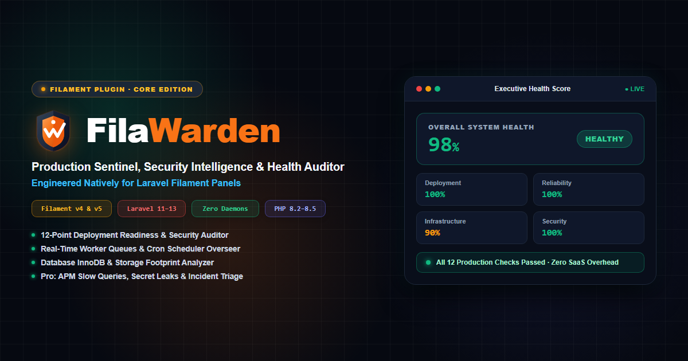

<p align="center">
  
</p>

<p align="center">
  <a href="https://packagist.org/packages/spiggle/filawarden-core"></a>
  <a href="https://github.com/skillbobby/Spiggle-FilaWarden-Core/actions"></a>
  <a href="https://php.net"></a>
  <a href="https://laravel.com"></a>
  <a href="https://filamentphp.com"></a>
  <a href="LICENSE.md"></a>
</p>

# FilaWarden Core

**High-Performance Operations Intelligence, Health Auditor & Production Sentinel for Filament.**

FilaWarden is a native operations intelligence suite built specifically for Laravel Filament. Designed to eliminate expensive third-party SaaS monitoring subscriptions, FilaWarden embeds deployment readiness auditing, queue worker tracking, cron overseer telemetry, and system diagnostics directly into your Filament admin panel with **zero external background daemons**.

---

## ⚡ Key Highlights & Important Architecture Info

* **Zero External Daemons**: No Node.js agents, Golang sidecars, or Docker daemons to maintain. Runs entirely on standard PHP runtime telemetry.
* **Non-Blocking Low Overhead**: Telemetry sampling uses native `/proc` and SQL engine caches with sub-millisecond execution times.
* **Filament v5 & v4 Certified**: Native support for Filament's latest responsive design patterns, dark mode, slide-over modals, and Livewire v3 components.
* **Mobile-Optimized**: Features a responsive dual-presentation layout—rendering touch-friendly cards on mobile devices and wide data tables on desktop viewports.

---

## 📦 Features (Core Edition)

| Module | Description |
| :--- | :--- |
| **Executive Operations Dashboard** | Aggregated multi-vector health scoring (Deployment, Infrastructure, Reliability, Security, Performance) from 0 to 100%. |
| **12-Point Deployment Auditor** | Production pre-flight verifications for `APP_DEBUG`, route/config/view caching, symlinks, SSL status, and worker processes. |
| **Infrastructure Telemetry** | Low-overhead memory consumption, CPU load averages, disk allocation, and PHP runtime specs without root privileges. |
| **Queue & Worker Monitor** | Real-time queue volume, failed worker message inspection with full stack traces, and single/batch retry and forget actions. |
| **Scheduled Tasks & Cron Overseer** | Live scheduled command registry, next execution timestamps, overlap guards, and scheduler heartbeat tracking. |
| **Database Performance & Health** | InnoDB buffer pool hit rates, active connection pools, storage footprint, and top 20 tables size breakdown. |
| **Application Error Log Reader** | Low-memory tail parser for `storage/logs/laravel.log` with log-level badges and one-click log truncation. |
| **SSL / TLS Certificate Sentinel** | Expiration countdown alerts, issuing CA verification, and cipher suite auditing. |
| **Dangerous File Scanner** | Filesystem risk detector for stray `.sql` dumps, compressed archives (`.zip`, `.tar`), and executable shell scripts (`.sh`). |

---

## 🚀 Pro Edition: FilaWarden Advanced

Looking for automated threat scanning, APM slow query tracing, and automated incident triage? Upgrade to **[FilaWarden Advanced (Pro Edition)](https://filawarden.com)**.

* 🛡️ **Security Intelligence Center**: Automated regex scanning for leaked Stripe/AWS API keys, exposed `.env` files, and HTTP security headers (CSP, HSTS).
* ⚡ **APM & Slow Query Registry**: Percentile latency metrics (P50, P95, P99), throughput (RPM), and SQL statement logging with exact caller file traces.
* 🚨 **Operational Incident Response**: Incident triage board with lifecycle states (`triggered` &rarr; `investigating` &rarr; `resolved`).
* 🔔 **Multi-Channel Alert Dispatcher**: Automated alert broadcasting to Slack, Discord, and custom Webhooks.
* 🎫 **TickitDex Webhook Integration**: Automated ticketing in TickitDex for alarms, security findings, and incidents (toggleable via `.env`).
* 🤖 **Autonomous AI Remediation**: One-click diagnosis and execution of cache compilations and performance routines.

👉 **[Purchase Pro on Lemon Squeezy](https://kodesmart.lemonsqueezy.com/checkout/buy/de7602d0-9edf-486f-b947-883bbf5ce584?enabled=2219342)** | **[Official Website](https://filawarden.com)**

---

## 📋 Requirements

* **PHP**: 8.2, 8.3, 8.4, or 8.5
* **Laravel Framework**: 11.x, 12.x, or 13.x
* **Filament**: 4.x or 5.x
* **Database**: MySQL 8.x, MariaDB 10.x, PostgreSQL 14+, or SQLite 3

---

## 🛠️ Installation

Install FilaWarden Core via Composer:

```bash
composer require spiggle/filawarden-core
```

Publish the configuration file (optional):

```bash
php artisan vendor:publish --tag=filawarden-config
```

---

## 🔌 Filament Admin Panel Registration

Register `FilaWardenPlugin` inside your Filament Panel Provider (typically `app/Providers/Filament/AdminPanelProvider.php`):

```php
namespace App\Providers\Filament;

use Filament\Panel;
use Filament\PanelProvider;
use Spiggle\FilaWarden\FilaWardenPlugin;

class AdminPanelProvider extends PanelProvider
{
    public function panel(Panel $panel): Panel
    {
        return $panel
            ->default()
            ->id('admin')
            ->path('admin')
            ->plugin(
                FilaWardenPlugin::make()
                    // All modules are enabled by default, or disable individually:
                    // ->deploymentAuditor(false)
                    // ->queueMonitor(false)
            );
    }
}
```

---

## ⚙️ Automated Telemetry Scheduling

To record telemetry snapshots and run scheduled health audits automatically, add the commands to your `routes/console.php` (or `app/Console/Kernel.php`):

```php
use Illuminate\Support\Facades\Schedule;

// Collect system telemetry every minute without overlapping:
Schedule::command('filawarden:collect')->everyMinute()->withoutOverlapping();

// Run deployment readiness check daily:
Schedule::command('filawarden:audit')->dailyAt('01:00');
```

---

## 💻 Artisan Commands

### Run Deployment Audit
```bash
php artisan filawarden:audit

# Format output as JSON for CI/CD pipelines:
php artisan filawarden:audit --json
```

### Collect Telemetry Snapshot
```bash
php artisan filawarden:collect
```

---

## 🧪 Testing

Run the automated test suite via PHPUnit / Pest:

```bash
composer test
# or via Laravel test runner:
php artisan test --filter=FilaWardenPluginTest
```

---

## 🔒 Security & Reporting

If you discover a security vulnerability within FilaWarden, please review our [Security Policy](SECURITY.md) and send an e-mail to **skillbobby@outlook.com**. All reports are investigated promptly.

---

## 📄 License

The MIT License (MIT). Please see [License File](LICENSE.md) for more information. Commercial Pro features require a valid license key from [Lemon Squeezy](https://filawarden.com).
